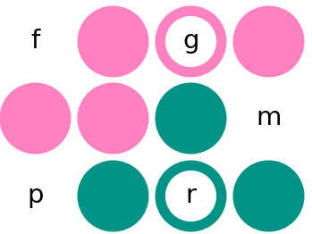

===================================
Enigma Tips and Tricks
===================================

Throughout this guide, we'll refer to this puzzle as an example, but these tips can really be applied to any puzzle!

.. figure:: ../sample\ puzzles/board\ a/1/jump.png
    :align: center

Concentrations of letters
-------------------------

If you have experience with similar grid-filling puzzles, you may gravitate toward the bottom left of the grid for this puzzle, since it seems to be the most restricted area and therefore the easiest to work with. However, we will see that it is actually much more helpful to start on the left side of the board. 

As you start each puzzle, I highly recommend locating each letter of the keyword and noting which ones are close to each other, as well as which are in convenient areas. For example, if a word contains the letter 'a', if there are no other nearby letters, there are only three pieces that can reveal the 'a'. This can be a vital piece of starting knowledge, especially when one or more of those pieces cannot be used. 

For this puzzle, we immediately notice that 'j' and 'u' are next to each other on the far left of the board. After trying all of the pieces, we can quickly find that there are only 8 possible configurations that could possibly reveal both 'j' and 'u' while revealing no other letters, shown below.

|c1| |c2| |c3| |c4| |c5| |c6| |c7| |c8|

.. |c1| image:: images/c1.png
    :width: 11%

Looking for constraints based on letters rather than geometry is crucial for puzzles with very few starting pieces.

Symmetry
--------

While 8 configurations is a lot, half of these can actually be eliinated immediately. The rules mention that each puzzle only has one possible solution. While this may just seem like a fun fact, it can actually be very useful in solving puzzles if you use it cleverly. In the cases above, notice that configurations 5 and 6 have the same shape, use the same pieces, and reveal the same letters. This means that no matter how the rest of the board is set up, these two configurations are interchangeable, so a puzzle with one of these configurations as a solution cannot have only one solution! Since the puzzle only has one solution, these configurations need not be considered. The same logic applies to configurations 7 and 8, leaving us with only 1, 2, 3, and 4. This reveals an important conclusion: the zigzag piece must be in one of the two spots above!

I like to call this method of elimination symmetry, since it occurs where there is a line of symmetry along the configuration. Some other examples of elimination via symmetry are shown below. 

|p1|       |p2|

.. |p1| image:: images/sym.png
    :width: 33%

Importantly, the piece's holes must be symmetrical as well: just like the shape itself, the revealed letters (or lack thereof) must be mirrored across the line of symmetry or else the configurations are not interchangeable (this is an oversimplification, but it will work). Below is an example of the shape having a lineof symmetry, but we can see that this won't work when mirrored.

|p3| |p4|

.. |p3| image:: images/fake_sym.png
    :width: 45%
.. |p4| image:: images/fake_sym_flipped.png
    :width: 45%

Note that a symmetry elimination cannot be used on a starter piece, since this piece is not interchangeable.

TALK HERE ABOUT BLANK SPACE SYMMETRY

Pieces with two holes
---------------------

This tip is particularly useful for board A, but if you're smart about it, these principles can be applied to other boards as well. However, I'll only discuss board A here for the sake of simplicity.

another good thing to do at the begnning of a puzzle, once you have located all required letters, is to see it any pieces with two holes can cover multiple letters. **Due to the unique position of the holes on 2-hole pieces, the pieces will only cover 2 or 0 letters, never just 1 on board A.** In the case of the 'jump' puzzle, there is one piece that can cover two letters, shown below in both configurations.

|f1| |f2|

.. |f1| image:: images/Figure_1.png
    :width: 45%

Let's assume these configurations are shown to not work. **We then know that no piece with 2 holes can reveal a letter.** This extra information can be very useful when trying to figure out what options you have for filling a part of the grid.

Flippable pieces
----------------

There are 3 pieces that can maintain the same shape on the board while changing what holes they cover. On board A specifically, only the zigzag piece can do this, as shown below. Can you figure out what the others are, and why they won't work on board A? This property can be a very powerful tool, so make sure to take full advantage of this flexibility!
|z1| |z2|

